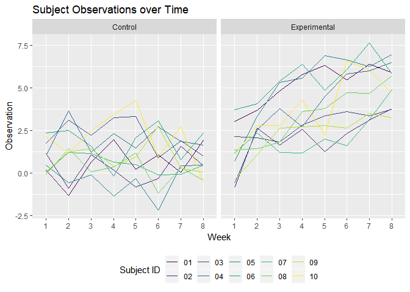

P8105 Homework 5: Iteration
================
Annie Clark
November 9, 2018

``` r
library(tidyverse)
```

    ## -- Attaching packages -------------------------------------------------------------------- tidyverse 1.2.1 --

    ## v ggplot2 3.0.0     v purrr   0.2.5
    ## v tibble  1.4.2     v dplyr   0.7.6
    ## v tidyr   0.8.1     v stringr 1.3.1
    ## v readr   1.1.1     v forcats 0.3.0

    ## -- Conflicts ----------------------------------------------------------------------- tidyverse_conflicts() --
    ## x dplyr::filter() masks stats::filter()
    ## x dplyr::lag()    masks stats::lag()

``` r
library(stringr)
library(purrr)
library(viridis)
```

    ## Loading required package: viridisLite

Problem 1
=========

This zip file contains data from a longitudinal study that included a control arm and an experimental arm. Data for each participant is included in a separate file, and file names include the subject ID and arm.

Part 1: Create a tidy dataframe
-------------------------------

Create a tidy dataframe containing data from all participants, including the subject ID, arm, and observations over time:

-   Start with a dataframe containing all file names; the list.files function will help
-   Iterate over file names and read in data for each subject using purrr::map and saving the result as a new variable in the dataframe
-   Tidy the result; manipulate file names to include control arm and subject ID, make sure weekly observations are “tidy”, and do any other tidying that’s necessary

``` r
## List of file names
file_names = list.files("./data")

## Function to read cvs files and add file name
read_csv_function = function(file_name) {
  subject_data = 
    read_csv(file = str_c("./data/", file_name)) %>% 
    mutate(file = file_name)
}

## Load all files + tidy data
subject_data = 
  map_df(file_names, read_csv_function) %>% 
  gather(key = week, value = observation, week_1:week_8) %>% 
  separate(file, into = c("group", "subject"), sep = "_") %>% 
  mutate(week = str_replace(week, "week_", ""),
         subject = str_replace(subject,".csv",""),
         group = recode(group, "con" = "control", 
                        "exp" = "experimental"))
```

    ## Parsed with column specification:
    ## cols(
    ##   week_1 = col_double(),
    ##   week_2 = col_double(),
    ##   week_3 = col_double(),
    ##   week_4 = col_double(),
    ##   week_5 = col_double(),
    ##   week_6 = col_double(),
    ##   week_7 = col_double(),
    ##   week_8 = col_double()
    ## )
    ## Parsed with column specification:
    ## cols(
    ##   week_1 = col_double(),
    ##   week_2 = col_double(),
    ##   week_3 = col_double(),
    ##   week_4 = col_double(),
    ##   week_5 = col_double(),
    ##   week_6 = col_double(),
    ##   week_7 = col_double(),
    ##   week_8 = col_double()
    ## )
    ## Parsed with column specification:
    ## cols(
    ##   week_1 = col_double(),
    ##   week_2 = col_double(),
    ##   week_3 = col_double(),
    ##   week_4 = col_double(),
    ##   week_5 = col_double(),
    ##   week_6 = col_double(),
    ##   week_7 = col_double(),
    ##   week_8 = col_double()
    ## )
    ## Parsed with column specification:
    ## cols(
    ##   week_1 = col_double(),
    ##   week_2 = col_double(),
    ##   week_3 = col_double(),
    ##   week_4 = col_double(),
    ##   week_5 = col_double(),
    ##   week_6 = col_double(),
    ##   week_7 = col_double(),
    ##   week_8 = col_double()
    ## )
    ## Parsed with column specification:
    ## cols(
    ##   week_1 = col_double(),
    ##   week_2 = col_double(),
    ##   week_3 = col_double(),
    ##   week_4 = col_double(),
    ##   week_5 = col_double(),
    ##   week_6 = col_double(),
    ##   week_7 = col_double(),
    ##   week_8 = col_double()
    ## )
    ## Parsed with column specification:
    ## cols(
    ##   week_1 = col_double(),
    ##   week_2 = col_double(),
    ##   week_3 = col_double(),
    ##   week_4 = col_double(),
    ##   week_5 = col_double(),
    ##   week_6 = col_double(),
    ##   week_7 = col_double(),
    ##   week_8 = col_double()
    ## )
    ## Parsed with column specification:
    ## cols(
    ##   week_1 = col_double(),
    ##   week_2 = col_double(),
    ##   week_3 = col_double(),
    ##   week_4 = col_double(),
    ##   week_5 = col_double(),
    ##   week_6 = col_double(),
    ##   week_7 = col_double(),
    ##   week_8 = col_double()
    ## )
    ## Parsed with column specification:
    ## cols(
    ##   week_1 = col_double(),
    ##   week_2 = col_double(),
    ##   week_3 = col_double(),
    ##   week_4 = col_double(),
    ##   week_5 = col_double(),
    ##   week_6 = col_double(),
    ##   week_7 = col_double(),
    ##   week_8 = col_double()
    ## )
    ## Parsed with column specification:
    ## cols(
    ##   week_1 = col_double(),
    ##   week_2 = col_double(),
    ##   week_3 = col_double(),
    ##   week_4 = col_double(),
    ##   week_5 = col_double(),
    ##   week_6 = col_double(),
    ##   week_7 = col_double(),
    ##   week_8 = col_double()
    ## )
    ## Parsed with column specification:
    ## cols(
    ##   week_1 = col_double(),
    ##   week_2 = col_double(),
    ##   week_3 = col_double(),
    ##   week_4 = col_double(),
    ##   week_5 = col_double(),
    ##   week_6 = col_double(),
    ##   week_7 = col_double(),
    ##   week_8 = col_double()
    ## )
    ## Parsed with column specification:
    ## cols(
    ##   week_1 = col_double(),
    ##   week_2 = col_double(),
    ##   week_3 = col_double(),
    ##   week_4 = col_double(),
    ##   week_5 = col_double(),
    ##   week_6 = col_double(),
    ##   week_7 = col_double(),
    ##   week_8 = col_double()
    ## )
    ## Parsed with column specification:
    ## cols(
    ##   week_1 = col_double(),
    ##   week_2 = col_double(),
    ##   week_3 = col_double(),
    ##   week_4 = col_double(),
    ##   week_5 = col_double(),
    ##   week_6 = col_double(),
    ##   week_7 = col_double(),
    ##   week_8 = col_double()
    ## )
    ## Parsed with column specification:
    ## cols(
    ##   week_1 = col_double(),
    ##   week_2 = col_double(),
    ##   week_3 = col_double(),
    ##   week_4 = col_double(),
    ##   week_5 = col_double(),
    ##   week_6 = col_double(),
    ##   week_7 = col_double(),
    ##   week_8 = col_double()
    ## )

    ## Parsed with column specification:
    ## cols(
    ##   week_1 = col_double(),
    ##   week_2 = col_double(),
    ##   week_3 = col_double(),
    ##   week_4 = col_double(),
    ##   week_5 = col_double(),
    ##   week_6 = col_double(),
    ##   week_7 = col_integer(),
    ##   week_8 = col_double()
    ## )

    ## Parsed with column specification:
    ## cols(
    ##   week_1 = col_double(),
    ##   week_2 = col_double(),
    ##   week_3 = col_double(),
    ##   week_4 = col_double(),
    ##   week_5 = col_double(),
    ##   week_6 = col_double(),
    ##   week_7 = col_double(),
    ##   week_8 = col_double()
    ## )
    ## Parsed with column specification:
    ## cols(
    ##   week_1 = col_double(),
    ##   week_2 = col_double(),
    ##   week_3 = col_double(),
    ##   week_4 = col_double(),
    ##   week_5 = col_double(),
    ##   week_6 = col_double(),
    ##   week_7 = col_double(),
    ##   week_8 = col_double()
    ## )
    ## Parsed with column specification:
    ## cols(
    ##   week_1 = col_double(),
    ##   week_2 = col_double(),
    ##   week_3 = col_double(),
    ##   week_4 = col_double(),
    ##   week_5 = col_double(),
    ##   week_6 = col_double(),
    ##   week_7 = col_double(),
    ##   week_8 = col_double()
    ## )
    ## Parsed with column specification:
    ## cols(
    ##   week_1 = col_double(),
    ##   week_2 = col_double(),
    ##   week_3 = col_double(),
    ##   week_4 = col_double(),
    ##   week_5 = col_double(),
    ##   week_6 = col_double(),
    ##   week_7 = col_double(),
    ##   week_8 = col_double()
    ## )
    ## Parsed with column specification:
    ## cols(
    ##   week_1 = col_double(),
    ##   week_2 = col_double(),
    ##   week_3 = col_double(),
    ##   week_4 = col_double(),
    ##   week_5 = col_double(),
    ##   week_6 = col_double(),
    ##   week_7 = col_double(),
    ##   week_8 = col_double()
    ## )
    ## Parsed with column specification:
    ## cols(
    ##   week_1 = col_double(),
    ##   week_2 = col_double(),
    ##   week_3 = col_double(),
    ##   week_4 = col_double(),
    ##   week_5 = col_double(),
    ##   week_6 = col_double(),
    ##   week_7 = col_double(),
    ##   week_8 = col_double()
    ## )

``` r
?fct_recode
```

    ## starting httpd help server ...

    ##  done

Part 2: Make a plot
-------------------

Make a spaghetti plot showing observations on each subject over time, and comment on differences between groups.

``` r
subject_data %>% 
  mutate(group = recode(group, "control" = "Control", "experimental" = "Experimental")) %>% 
  ggplot(aes(x = week, y = observation, group = subject, color = subject)) + 
    geom_path() + 
    facet_grid(~group) + 
    labs(
      title = "Subject Observations over Time",
      x = "Week",
      y = "Observation"
    ) + 
    theme(legend.position = "bottom") +
    viridis::scale_color_viridis(
      name = "Subject ID", 
      discrete = TRUE
    )
```



The observations for the subjects in the control arm over the 8 weeks stay relatively constant over (and potentially decreasing), while the observations for the subjects in the experimental arm have an increasing trend. I would be interested in doing additional statistical analysis to confirm that the treatment had a significant effect on the outcome.

Please note: it is unclear if the subject IDs are unique within the control/experimental arms or are global subject IDs (suggesting that each of the IDs went through both the control and experimental arms). If the subject IDs are only unique within the arms, I would change the above graphs to make it clearer that the subjects with the same subject IDs from both arms are different.

Problem 2
=========

The Washington Post has gathered data on homicides in 50 large U.S. cities and made the data available through a GitHub repository here. You can read their accompanying article here.

``` r
homicide_url = "https://raw.githubusercontent.com/washingtonpost/data-homicides/master/homicide-data.csv"

## Read in data from github
homicide_data = 
  read.csv(url(homicide_url)) %>% 
  janitor::clean_names() %>% 
  as_tibble()
```

Part 1: Describe the data
-------------------------

### Prompt

Describe the raw data.

### Response

The homicide dataset has 52179 rows and 12 columns. Each row contains information about a single homicide that has occurred, such as location (city, state, latitude/longitude), victim information (first/last name, age, sex, disposition) and information about the homicide (disposition, reported date, id). The date range of reports spans from 20070101 to 20171231. There are two invalid reported date values that are most likely typos ("201511105" and "201511018"). The data includes 50 cities in 28 states. There are a total of 51 distinct city/state combinations, including Tulsa, AL. This is most likely a typo for Tulsa OK (confirmed with the longitude/latitude coordinates). Because this particular homicide was closed with an arrest and the primary purpose of the analysis is to look at unsolved homicides, this case was not included in the analysis.

49% of the homicides were solved by arrest and 51% of the cases are considered unsolved (solved with no arrest or still open/no arrest).

78% of the homicides had male victims, 14% of homicides had female victims and the remaining 78% of cases had unknown genders of the victims.

Part 2: Number of homicides and unsolved homicides per city
-----------------------------------------------------------

Create a city\_state variable (e.g. “Baltimore, MD”) and then summarize within cities to obtain the total number of homicides and the number of unsolved homicides (those for which the disposition is “Closed without arrest” or “Open/No arrest”).

``` r
## Create city_state var and summarise by city_state
homicide_data =
  homicide_data %>% 
  mutate(city_state = str_c(city, state, sep = ", ")) %>% 
  group_by(city_state) %>% 
  mutate(total_city_homicides = n()) %>% 
  filter(disposition %in% c("Closed without arrest", "Open/No arrest")) %>% 
  summarise(unsolved_homicides = n(),
            total_homicides = max(total_city_homicides))
```

Part 3: Unsolved homicides in Baltimore
---------------------------------------

For the city of Baltimore, MD, use the prop.test function to estimate the proportion of homicides that are unsolved; save the output of prop.test as an R object, apply the broom::tidy to this object and pull the estimated proportion and confidence intervals from the resulting tidy dataframe.

``` r
## Function to run prop_test + clean up results
homicide_prop = function(df) {
  homicide_prop_test = prop.test(df$unsolved_homicides, df$total_homicides, 
            alternative = "two.sided", conf.level = 0.95, correct = FALSE)
  
  broom::tidy(homicide_prop_test) %>% 
    select(estimate, conf.low, conf.high)
}

## Prop.test function applied to Baltimore, MD
homicide_data %>% 
  filter(city_state == "Baltimore, MD") %>% 
  homicide_prop() %>% 
  rename("Proportion of Unsolved Cases" = estimate, 
         "Lower bound (95% CI)" = conf.low, 
         "Upper bound (95% CI)" = conf.high) %>% 
  knitr::kable()
```

|  Proportion of Unsolved Cases|  Lower bound (95% CI)|  Upper bound (95% CI)|
|-----------------------------:|---------------------:|---------------------:|
|                     0.6455607|             0.6277411|             0.6629852|

Part 4: Unsolved homicides per city
-----------------------------------

Now run prop.test for each of the cities in your dataset, and extract both the proportion of unsolved homicides and the confidence interval for each. Do this within a “tidy” pipeline, making use of purrr::map, purrr::map2, list columns and unnest as necessary to create a tidy dataframe with estimated proportions and CIs for each city.

``` r
## Prop test function applied to all cities
homicide_data = 
  homicide_data %>% 
  nest(unsolved_homicides:total_homicides) %>% 
  mutate(prop_tests = map(.x = .$data, ~homicide_prop(.x))) %>% 
  unnest() %>% 
  rename(unsolved_estiamte = estimate, lower_bound = conf.low,
         upper_bound = conf.high)
```

Part 5: Create a plot
---------------------

Create a plot that shows the estimates and CIs for each city – check out geom\_errorbar for a way to add error bars based on the upper and lower limits. Organize cities according to the proportion of unsolved homicides.

``` r
homicide_data %>% 
  mutate(city_state = forcats::fct_reorder(city_state, desc(unsolved_estiamte))) %>%
  ggplot(aes(x = city_state, y = unsolved_estiamte, color = city_state)) + 
    geom_point() +
    geom_errorbar(aes(ymin = lower_bound, ymax = upper_bound, width = 0.2)) + 
    theme(axis.text.x = element_text(angle = 60, hjust = 1)) + 
    labs(
        title = "Proportion of Unsolved Homicides in 50 Large Cities",
        x = "City, State",
        y = "Proportion of Unsolved Cases", 
        caption = "Data from the Washington Post"
      ) +
    theme(legend.position = "none") +
    viridis::scale_color_viridis(
      discrete = TRUE
    )
```


The city with the largest proportion of unsolved homicides is Chicago (0.74) and it also has very narrow bounds on the 95% confidence interval for the point estimate. This means that there is more certainty around the number of unsolved homicides in Chicago being over 0.7. The lowest proportion of unsolved homicides is Richmond Virginia. The cities with the highest variability in unsolved homocide proportions are Savannah, GA and Tampa, FL.
